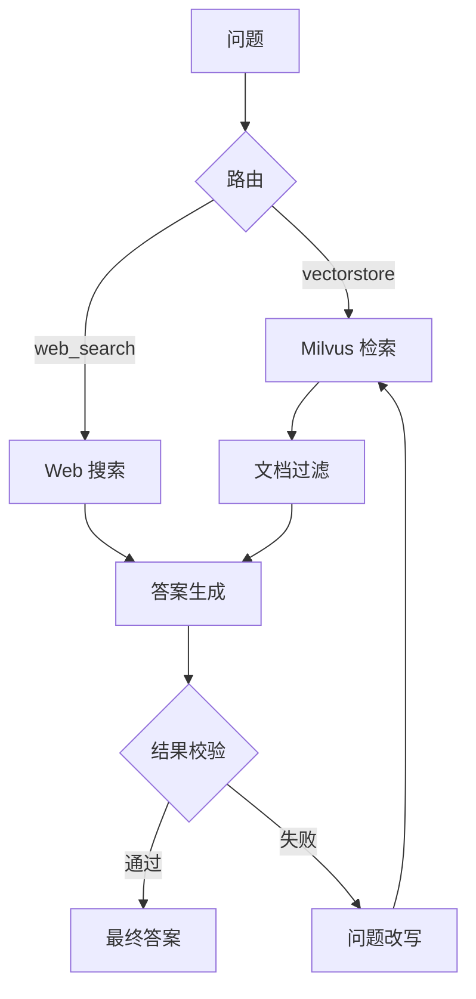

# RAG_PROJECT 项目 Wiki

> 基于当前仓库代码快照整理，时间：2026-05-11。

## 1. 项目简介

`RAG_PROJECT` 是一个面向半导体技术问答场景的 Agentic RAG 项目，核心目标是把专业资料做成一个可检索、可回答、可评测、可演示的知识系统。

项目当前已经覆盖：

- Markdown 知识入库
- Milvus 混合检索
- LangGraph 工作流编排
- 问题路由、查询改写、文档过滤、答案生成、幻觉校验
- RAGAS 批量评测
- Gradio 文本/语音 Demo
- 图片、视频入库与讲解视频生成扩展

## 2. 技术选型

| 层 | 技术 | 作用 |
| --- | --- | --- |
| 编排 | LangGraph | 搭建带分支和循环的 RAG 工作流 |
| RAG 框架 | LangChain | Prompt、Retriever、Tool、结构化输出 |
| 向量库 | Milvus | 存储 dense + sparse 双索引 |
| Embedding | `BAAI/bge-base-zh-v1.5` | 中文语义向量 |
| 稀疏检索 | Milvus BM25 | 补足术语精确匹配 |
| Reranker | `BAAI/bge-reranker-v2-m3` | 精排候选文档 |
| 大模型 | 当前默认 `doubao-seed-2-0-lite-260215` | 路由、过滤、生成、评测分析 |
| Web 搜索 | Tavily | 知识库外或实时信息兜底 |
| 评测 | RAGAS | `faithfulness` 等四项指标 |
| 前端 | Gradio | 文本/语音问答 Demo |
| 多模态 | GPT-4o / Whisper / Sora / Kling | 图像理解、语音转写、视频生成 |

## 3. 项目结构

```text
RAG_PROJECT/
├─ app_graph2.py            # Gradio Demo
├─ documents/               # 文档解析、Milvus 建表、写库
├─ graph/                   # 第一代图流程
├─ graph2/                  # 当前主流程
├─ llm_models/              # LLM 与 embedding 配置
├─ multimodal_RAG/          # 图片/视频入库与视频生成
├─ tools/                   # 检索器封装
├─ utils/                   # 日志、环境变量、绘图
└─ datas/                   # 知识库、评测结果、图片、PDF 等数据
```

当前仓库里可见的核心数据规模大致为：

- `datas/md/`：约 430 个 Markdown 文件
- `datas/PDF/`：5 个 PDF
- `datas/image_input/`：64 个图片文件
- `datas/evaluation/`：保留了第 1 次到第 22 次评测结果

## 4. 核心架构

项目可以分成四条主线：

1. **入库链路**：Markdown / 图片 / 视频 -> 解析 -> `Document` -> Milvus
2. **问答链路**：问题 -> 路由 -> 检索 / Web -> 过滤 -> 生成 -> 校验
3. **评测链路**：固定测试集 -> 跑图 -> RAGAS -> badcase 分析 -> 可视化
4. **演示链路**：Gradio -> 文本 / 语音提问 -> 图执行日志 -> 最终答案

## 5. 文档入库原理

### 5.1 Markdown 入库

入口是 `documents/markdown_parser.py` 和 `documents/write_milvus.py`。

处理流程：

1. 用 `UnstructuredMarkdownLoader` 解析 Markdown
2. 合并标题和正文块
3. 对长内容用 `SemanticChunker` 做语义切块
4. 加入 chunk overlap
5. 写入 Milvus

### 5.2 Milvus 设计

定义在 `documents/milvus_db.py`。

关键点：

- dense 向量：768 维
- sparse 向量：Milvus 内置 BM25 Function 生成
- dense 索引：HNSW
- sparse 索引：SPARSE_INVERTED_INDEX
- 检索时通过 RRF 融合 dense + sparse 结果

### 5.3 一个重要注意点

`documents/write_milvus.py` 会重建 collection。也就是说，重跑写库脚本会清空原有索引数据，这个行为适合实验环境，不适合直接当增量更新脚本使用。

## 6. 问答主流程：`graph2`

当前主流程入口是 `graph2/graph_2.py`。

主图逻辑：

1. `route_question`：先判断走知识库还是 Web 搜索
2. `retrieve`：从 Milvus 做混合召回
3. `grade_documents`：用 LLM 过滤掉不相关文档
4. `generate`：严格基于上下文生成答案
5. `grade_generation_v_documents_and_question`：检查幻觉与答题有效性
6. 如果失败，则 `transform_query` 改写问题后重试

简化流程如下：



## 7. 两个 Reranker 实验版本

### 7.1 `graph_2_replace.py`

思路是：

- 宽召回 `k=30`
- 用 BGE Reranker 精排到 top-5
- 跳过 LLM 文档过滤

适合验证 reranker 能否替代 grader。

### 7.2 `graph_2_coexist.py`

思路是：

- 宽召回 `k=30`
- reranker 先精排
- LLM grader 再过滤

适合验证“reranker + grader”是否比单独使用其中一方更稳。

## 8. 评测体系

入口是 `graph2/ragas_eval.py`。

当前评测不是临时造题，而是读取固定测试集：

- `datas/evaluation/fixed_ragas_cases.json`

评测输出包括：

- 测试样本 JSON
- 明细 CSV
- 指标汇总 JSON
- `run_status.json`

核心指标：

- `faithfulness`
- `answer_relevancy`
- `context_precision`
- `context_recall`

从 `datas/evaluation/第22次结果/graph2_ragas_summary_20260507_184444.json` 可见一组代表性结果：

| 指标 | mean | pass_rate |
| --- | ---: | ---: |
| faithfulness | 0.9573 | 1.00 |
| answer_relevancy | 0.8774 | 1.00 |
| context_precision | 0.8139 | 0.60 |
| context_recall | 0.8167 | 0.80 |

这说明当前系统的主要瓶颈更偏向检索质量，而不是生成真实性。

## 9. 多模态扩展

`multimodal_RAG/` 目录提供了三类能力：

1. **图片入库**：图片 -> GPT-4o 描述 -> 写入 Milvus
2. **视频入库**：音轨转写 + 抽帧描述 -> 写入 Milvus
3. **讲解视频生成**：文本答案 -> Sora / Kling 视频

另外，`pdf_image_extractor.py` 可以先从 PDF 里抽图，再走图片入库链路。

## 10. 运行方式

安装基础依赖：

```bash
pip install -r requirements.txt
```

主要命令：

```bash
python -m documents.write_milvus
python -m graph2.graph_2
python -m graph2.ragas_eval --mode original --case-count 10 --workers 4 --threshold 0.6
python app_graph2.py
python -m multimodal_RAG.graph_video
```

## 11. 当前工程现状

这个项目已经具备完整实验闭环，但仍然有几处很值得明确说明：

### 11.1 配置管理还偏实验态

- `COLLECTION_NAME` 硬编码
- `MILVUS_URI` 有默认值
- `TAVILY_API_KEY` 在代码里直接写入环境变量

### 11.2 `requirements.txt` 不完整

仓库实际还依赖一些未写入的包，例如：

- `gradio`
- `matplotlib`
- `requests`
- `opencv-python`
- `PyJWT`
- `PyMuPDF`

### 11.3 多模态入库和主检索链路没有完全打通

这是当前实现里最关键的限制之一。

原因是 `tools/retriever_tools.py` 的检索过滤条件固定为：

```python
filter={"category": "content"}
```

而图片、视频入库后的 `category` 分别是 `Image`、`VideoTranscript`、`VideoFrame`。  
结果就是：多模态内容虽然写进了 Milvus，但默认不会被 `graph2` 主问答流程检索到。

### 11.4 `replace/coexist` 评测模式存在实现缺口

`graph2/ragas_eval.py` 期望 `graph_2_replace.py` 和 `graph_2_coexist.py` 导出 `get_graph()`，但当前文件里没有这个函数，因此这两个模式按现状很可能不能直接运行。

## 12. 总结

`RAG_PROJECT` 的本质不是一个简单 RAG Demo，而是一个围绕半导体知识问答构建的实验型 RAG 平台。它已经有完整的文本主链路、评测闭环和多模态扩展雏形。

如果继续往前推进，优先级最合理的三件事是：

1. 补齐配置治理和依赖清单
2. 继续优化召回与上下文精度
3. 真正打通多模态内容到主检索链路

